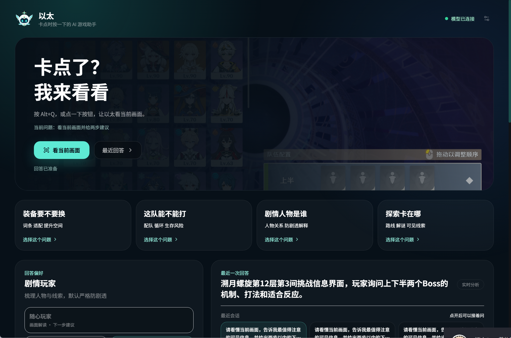
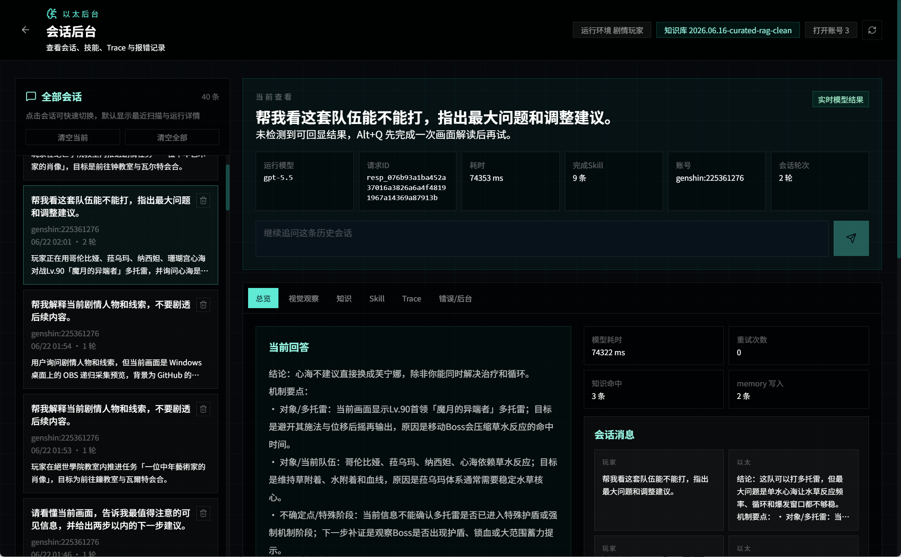

# 以太 AI 游戏伴侣

以太是一个本地桌面 AI 游戏伴侣。玩家按 `Alt+Q` 或点击首页按钮后，以太会临时读取当前屏幕画面，结合会话上下文、回答偏好、公开账号信息和攻略来源，生成中文、简短、可执行的下一步建议。

它不是外挂、宏或自动化脚本：不读取游戏进程内存，不抓包，不自动点击或操作游戏客户端，只在玩家主动触发时分析屏幕截图。

## 首页



首页面向玩家使用，核心入口是：

- `Alt+Q` 或 `看当前画面`：分析当前画面。
- 场景卡：选择本轮想问的方向，例如装备、配队、剧情或探索；点击后只改变意图，不会立即截图。
- 回答偏好：调整回答语气和信息密度。
- 继续追问：在当前会话内接着问，不重新截图，默认复用上一轮画面观察。
- 最近回答：查看完整回答、参考资料和可执行建议。

## 后台



后台用于复盘和排障，包含：

- 历史会话列表和会话详情联动。
- 视觉观察、知识来源、Skill、Trace 和错误记录。
- 历史会话继续追问。
- 本地会话删除和清空。
- 运行环境、模型、知识库版本等诊断信息。

## 核心能力

- **屏幕理解**：通过 Electron 截图能力读取鼠标所在显示器或指定窗口。
- **多模态推理**：默认通过本地 Sub2API 网关调用 `gpt-5.5`。
- **继续追问**：同一会话内保留上下文，追问时复用上一轮画面观察。
- **搜索优先攻略问答**：装备、配队、机制、任务、活动、探索、成就、剧情回顾等攻略意图优先走联网检索；本地知识库只在高置信命中时直接回答。
- **知识来源可追溯**：首页显示玩家可读的参考资料，后台显示完整检索链路。
- **本地历史管理**：会话、run、trace、cache 和 memory 写入本地，后台可删除。

## 技术结构

```text
React / Vite
  - PlayerHome：首页、场景卡、继续追问、最近回答
  - AnswerCard：短答案卡
  - Dashboard：后台详情、Trace、Skill、知识来源

Electron
  - 全局快捷键、托盘、窗口管理
  - desktopCapturer 截图
  - IPC 与 preload API
  - 本地配置加载

Agent Runtime
  - 视觉特征提取
  - 会话与 memory
  - 本地知识库与联网检索
  - 模型调用、错误记录、trace
```

## 环境要求

- Windows 桌面环境。
- Node.js 22.x 或更新版本。
- npm。
- Docker Desktop，使用本地 Sub2API 网关时需要。
- 可用的 OpenAI-compatible 模型服务。默认配置为本机 Sub2API：`http://127.0.0.1:8080/v1`。
- Tavily API key 可选，用于联网攻略检索兜底。

## 快速启动

### 1. 安装依赖

```bash
git clone https://github.com/Swindyk/Aether_Demo.git
cd Aether_Demo
npm install
```

### 2. 启动 Sub2API

Sub2API 不包含在本仓库内。进入你本机的 Sub2API 项目目录后启动 Docker 服务：

```bash
cd <SUB2API_DIR>
docker compose up -d
docker compose ps
```

健康检查：

```powershell
Invoke-WebRequest http://127.0.0.1:8080/health -UseBasicParsing
```

正常情况下应返回类似：

```json
{"status":"ok"}
```

### 3. 配置以太

复制本地配置文件：

```powershell
Copy-Item .env.example .env.local
```

在 `.env.local` 中填写项目运行时配置：

```text
AETHER_LLM_PROVIDER=Sub2Api
AETHER_LLM_BASE_URL=http://127.0.0.1:8080/v1
AETHER_LLM_WIRE=responses
AETHER_LLM_MODEL=gpt-5.5
AETHER_LLM_FAST_VISION_MODEL=gpt-5.5
AETHER_LLM_API_KEY=你的本地 Sub2API API Key

# 可选：攻略联网检索
TAVILY_API_KEY=你的 Tavily API Key
```

不要提交 `.env`、`.env.local` 或任何真实 API key。本项目只读取项目内环境变量，不读取 Codex 的 `.codex/auth.json` 或 `.codex/config.toml`。

### 4. 启动开发版

```bash
npm run dev
```

启动后可点击首页 `看当前画面`，或在目标画面上按 `Alt+Q`。

## 构建与打包

```bash
npm run build
npm run pack
```

- `npm run build`：构建渲染层。
- `npm run pack`：生成 Windows portable 版本到 `release/`。

`release/` 已被 `.gitignore` 忽略。打包时可以把本地 `.env` 复制到 release 目录便于本机演示，但不要提交 release 目录或真实密钥。

## 常用脚本

```bash
npm test
npm run eval:rag
npm run build
npm run pack
```

- `npm test`：运行 Electron 侧单元测试。
- `npm run eval:rag`：运行知识检索评估。
- `npm run build`：构建前端产物。
- `npm run pack`：生成本地便携版。

## 配置优先级

模型配置集中在 `electron/model-config.cjs`，建议使用新的 `AETHER_LLM_*` 变量：

1. `AETHER_LLM_*`
2. 兼容旧变量：`AETHER_MODEL_*`
3. 兼容 OpenAI 风格变量：`OPENAI_*`

默认推荐：

```text
AETHER_LLM_PROVIDER=Sub2Api
AETHER_LLM_BASE_URL=http://127.0.0.1:8080/v1
AETHER_LLM_WIRE=responses
AETHER_LLM_MODEL=gpt-5.5
```

如果接入其他 OpenAI-compatible endpoint，替换 `BASE_URL`、`MODEL` 和 `API_KEY` 即可。若服务只支持 Chat Completions，把 `AETHER_LLM_WIRE` 改为 `chat`。

## 常见问题

### 为什么配置的是 gpt-5.5，界面显示另一个模型？

以太请求时使用 `AETHER_LLM_MODEL`，后台展示的是模型服务响应里的实际 `model` 字段。如果网关做了模型别名映射，界面会显示网关实际返回的模型名。

### 模型服务鉴权失败怎么办？

检查：

- Sub2API 是否正在运行。
- `AETHER_LLM_BASE_URL` 是否是 `http://127.0.0.1:8080/v1`。
- `.env.local` 或 `.env` 中是否有有效的 `AETHER_LLM_API_KEY`。
- 不要把模型配置写到 `.codex`，以太不会读取 Codex 配置。

### 截图黑屏或识别不到游戏怎么办？

优先使用无边框窗口模式。独占全屏、受保护窗口或系统权限不足时，Electron 可能无法稳定截图。也可以在首页手动选择显示器或窗口来源。

### 场景卡为什么点了不开始识别？

这是预期行为。场景卡只是选择问题方向；只有 `Alt+Q` 或 `看当前画面` 才会开始截图和模型调用。

### 继续追问会重新截图吗？

默认不会。追问会复用当前会话的上一轮视觉观察和知识命中，适合接着问“怎么打”“换成保守方案”“机制是什么”等问题。

## 操作文档

- [首页操作手册](docs/operation-home.md)
- [后台操作手册](docs/operation-dashboard.md)

## 提交前检查

提交前建议运行：

```powershell
git status --short
git diff --cached --name-only
Select-String -Path (git ls-files) -Pattern 'ms-[0-9a-f-]{10,}|tvly-[A-Za-z0-9_-]+|sk-[A-Za-z0-9_-]{20,}' -ErrorAction SilentlyContinue
```

确认事项：

- 不提交 `.env`、`.env.local`、`.env.bak-*`。
- 不提交 `release/`、`release-*`。
- 不提交真实 API key。
- 不提交产品方案 PDF。
